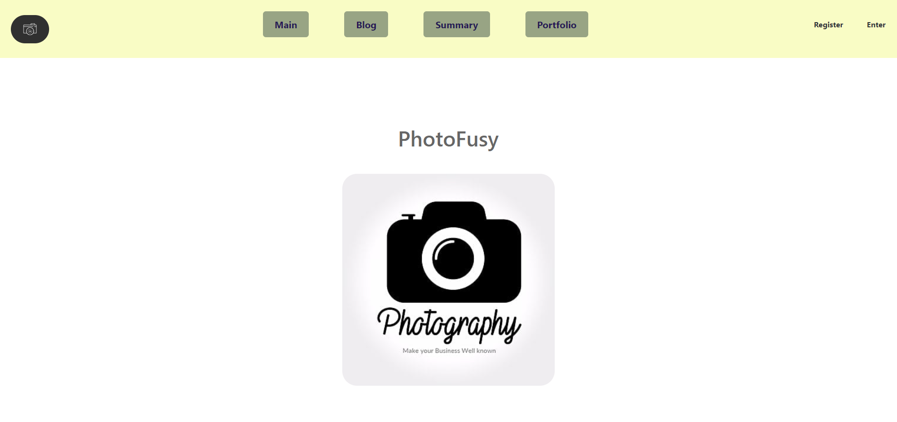
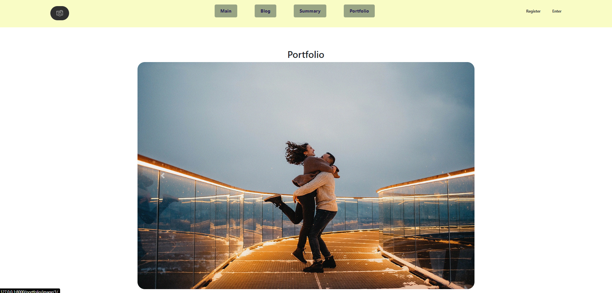

# PH_photofusy
## Предпросмотр главной страницы и страницы с портфолио



## Введение

Добро пожаловать в репозиторий проекта PH_photofusy! Это приложение предназначено для автоматизации процесса записи пользователей на фотосессии, упрощения работы фотографа и обеспечения пользователей инструментами для выбора и бронирования фотосессий.

## Разделы

### Приветственный раздел

В разделе "Приветствие" пользователи могут ознакомиться с навыками фотографа и просмотреть его портфолио. Это поможет пользователям оценить квалификацию и стиль работы фотографа.

### Блог

В этом разделе пользователи могут увидеть полезную информацию о проведении фотосессий, различные новости, и узнать о скидках и предстоящих событиях.

### Регистрация и аутентификация

Для того чтобы пользоваться приложением, пользователи должны зарегистрироваться и аутентифицироваться. Это обеспечивает безопасность данных и позволяет сохранять историю бронирований.

### Выбор типов фотосессий

В данный момент в разделе "Выбор типов фотосессий" доступны четыре типа фотосессий:

- Анималистическая фотосъемка
- Свадебная фотосессия
- Студийная фотосъемка
- Лавстори

Обратите внимание, что этот раздел находится в разработке, и пока недоступен. Планируется реализовать аутентификацию через почту, реализовать управление сайтом через отдельный вэб интерфейс, поправить стили.

### Бронирование даты

Пользователи могут легко бронировать даты для фотосессий в удобное для них время. Это снижает нагрузку на фотографа и обеспечивает удобство для клиентов.

### Личный кабинет

Личный кабинет пользователя предоставляет доступ к истории бронирований фотосессий. Пользователи могут просматривать и управлять своими записями.

### Система скидок и любимые категории

Мы предлагаем систему скидок для постоянных клиентов и возможность выбирать "любимые" категории фотосессий, чтобы получать уведомления о новых предложениях и акциях.

### Оповещения через Telegram

Предполагается реализовать систему оповещения о предстоящих фотосессиях через Telegram бота. Это поможет вам не пропустить важные события. Обратите внимание, что этот раздел находится в разработке, и пока недоступен.

## Как связаться

Если у вас есть вопросы или предложения по улучшению приложения, не стесняйтесь писать на нашу электронную почту: aleksandr.tailakov@mail.ru

## Технологический стек

- Язык программирования: Python, JavaScript
- Фреймворк: Django
- База данных: SQLight
- Другие зависимости: Библиотеки: datatime, Decimal, AdminDateWidget, AdminTimeWidget, AdminSplitDateTime, telebot, beautifulsoup4. Разметка: CSS, HTML.

## Установка

Для запуска проекта у вас должен быть установлен Python и pip. Затем выполните следующие шаги:

1. Клонируйте репозиторий:

    ```bash
    git clone https://github.com/your-username/PH_photofusy.git
    cd PH_photofusy
    ```

2. Создайте виртуальное окружение:

    ```bash
    python -m venv venv
    ```

3. Активируйте виртуальное окружение:

    - Для Windows:

        ```bash
        .\venv\Scripts\activate
        ```

    - Для macOS и Linux:

        ```bash
        source venv/bin/activate
        ```

4. Установите зависимости:

    ```bash
    pip install -r requirements.txt
    ```

5. Примените миграции:

    ```bash
    python manage.py migrate
    ```

6. Запустите сервер:

    ```bash
    python manage.py runserver
    ```

После выполнения этих шагов ваше приложение должно быть доступно по адресу http://127.0.0.1:8000/.

## Завершение

Спасибо, что выбрали PH_photofusy! Мы надеемся, что наше приложение сделает процесс бронирования фотосессий легче и приятнее для всех пользователей. Если у вас возникнут какие-либо вопросы при использовании приложения, не забудьте посетить раздел справки или связаться с нами.

Этот README файл будет обновляться по мере развития проекта, чтобы обеспечить пользователям актуальную информацию и инструкции по использованию.
